# AI Daily Intelligence Web V1 Database Schema

> 상태: 제품·UX 및 기술 설계 승인 — 구현 지시 대기
> 작성일: 2026-08-07 (Asia/Seoul)
> 대상: Supabase PostgreSQL
> 원칙: Git 콘텐츠 정본을 Event 중심 서비스 조회 모델로 투영하고 사용자 데이터는 분리한다.

## 1. 데이터 소유권

| 데이터 | 정본 | Supabase 역할 |
|---|---|---|
| 일일 Intelligence 콘텐츠 | GitHub `main/data/daily/**` | 재구축 가능한 조회 projection |
| 날짜별 보고서 | GitHub `reports/**` | 링크 및 경로 참조 |
| 사용자 계정 | Supabase Auth | 인증 정본 |
| Profile, reaction, bookmark, follow | Supabase | 사용자 기능 정본 |
| Import 상태 | Supabase private operations schema | 동기화 운영 기록 |

콘텐츠 projection은 Git으로부터 재구축할 수 있어야 한다. 사용자 데이터는 Git backfill이나 콘텐츠 재동기화 과정에서 삭제하거나 덮어쓰면 안 된다.

## 2. ERD

```mermaid
erDiagram
    AUTH_USERS ||--|| PROFILES : owns
    PROFILES ||--o{ REACTIONS : creates
    PROFILES ||--o{ BOOKMARKS : saves
    PROFILES ||--o{ FOLLOWS : follows

    DAILY_BRIEFINGS ||--o{ DAILY_BRIEFING_EVENTS : contains
    EVENTS ||--o{ DAILY_BRIEFING_EVENTS : appears_in

    EVENTS ||--o{ EVENT_ANALYSIS : has_versions
    EVENTS ||--o{ EVENT_SOURCES : supported_by
    SOURCES ||--o{ EVENT_SOURCES : supports

    EVENTS ||--o{ EVENT_TOPICS : classified_as
    TOPICS ||--o{ EVENT_TOPICS : classifies

    EVENTS ||--o{ EVENT_ENTITIES : mentions
    ENTITIES ||--o{ EVENT_ENTITIES : mentioned_in

    OPPORTUNITIES ||--o{ OPPORTUNITY_EVENTS : supported_by
    EVENTS ||--o{ OPPORTUNITY_EVENTS : supports
    DAILY_BRIEFINGS ||--o{ DAILY_BRIEFING_OPPORTUNITIES : includes
    OPPORTUNITIES ||--o{ DAILY_BRIEFING_OPPORTUNITIES : appears_in

    DAILY_BRIEFINGS ||--o{ DAILY_BRIEFING_RESOURCES : includes
    RESOURCES ||--o{ DAILY_BRIEFING_RESOURCES : displays

    DAILY_BRIEFINGS ||--o{ TREND_SIGNALS : summarizes

    EVENTS ||--o{ REACTIONS : receives
    EVENTS ||--o{ BOOKMARKS : saved_as
    TOPICS ||--o{ FOLLOWS : followed_as

    SYNC_RUNS ||--o{ SYNC_RUN_ITEMS : processes
    SYNC_CURSORS ||--o{ SYNC_RUN_ITEMS : orders
```



## 3. Enum 설계

### 콘텐츠

```text
event_importance: S | A | B
publication_state: draft | published | archived | needs_review
briefing_status: complete | partial
analysis_language: ko | en
analysis_parse_status: parsed | partial | unparsed
opportunity_potential: Low | Medium | High | Very High
candidate_status: none | waiting_for_owner | approved_for_design | rejected
```

`approved_for_design`은 명시적인 사용자 승인 후 설계 상태만 나타내며 제품 구현 승인을 의미하지 않는다.

### Source

```text
source_type:
  official_blog | article | youtube | x | github |
  paper | documentation | reddit | hackernews | other

source_authority:
  official | primary | independent | analysis | community

verification_status:
  verified | corroborated | unverified | disputed
```

`authority`는 Source 자체의 성격이고 `verification_status`는 특정 Event에 대한 근거 상태이므로 각각 `sources`와 `event_sources`에 분리한다.

### 사용자와 운영

```text
reaction_sentiment: like | dislike
resource_type: tool | open_source | paper | youtube | blog | documentation | other
sync_status: running | succeeded | failed | skipped
```

## 4. 콘텐츠 테이블

### `daily_briefings`

날짜별 packet과 Today 구성을 나타낸다.

| Column | Type | Constraint/의미 |
|---|---|---|
| `id` | uuid | PK, generated |
| `date_kst` | date | UNIQUE, Git idempotency key |
| `generated_at` | timestamptz | required |
| `status` | briefing_status | required |
| `publication_state` | publication_state | required, default draft |
| `todays_insight` | text | required |
| `warnings` | jsonb | required, default `[]` |
| `schema_version` | text | required |
| `source_data_path` | text | required |
| `source_report_path` | text | nullable |
| `source_commit_sha` | text | required |
| `source_revision` | bigint | required, full Git main history의 monotonic revision |
| `source_checksum` | text | required |
| `imported_at` | timestamptz | required |
| `created_at` | timestamptz | required |
| `updated_at` | timestamptz | required |

제약:

- `date_kst` unique
- `source_checksum`은 SHA-256 형식 검사
- `warnings`는 JSON array 검사

### `events`

Event의 안정적인 정체성과 현재 표시 필드를 보유한다.

| Column | Type | Constraint/의미 |
|---|---|---|
| `id` | uuid | PK |
| `event_key` | text | UNIQUE, Git `news[].event_key` |
| `slug` | text | UNIQUE, immutable public route key |
| `title_original` | text | required |
| `title_ko` | text | nullable |
| `one_line_summary_ko` | text | nullable |
| `importance` | event_importance | required |
| `hero_image_url` | text | nullable |
| `hero_image_source_id` | uuid | nullable FK → sources |
| `hero_image_attribution` | text | nullable, publisher/creator/source 표시 |
| `hero_image_alt_ko` | text | nullable |
| `publication_state` | publication_state | required |
| `first_seen_date` | date | required |
| `last_seen_date` | date | required |
| `current_source_revision` | bigint | required |
| `source_schema_version` | text | required |
| `created_at` | timestamptz | required |
| `updated_at` | timestamptz | required |

제약:

- `first_seen_date <= last_seen_date`
- `hero_image_url`이 있으면 `hero_image_source_id`와 `hero_image_attribution`이 모두 필요함
- importer는 연결 Source가 검증 가능한 원문 또는 공식 출처인지 확인하고 그렇지 않으면 image를 저장하지 않음
- AI 생성 이미지는 V1 Event hero image로 허용하지 않음
- Event hard delete 대신 `archived` 사용

### `event_analysis`

Event 분석을 버전과 언어별로 보존한다.

| Column | Type | Constraint/의미 |
|---|---|---|
| `id` | uuid | PK |
| `event_id` | uuid | FK → events, required |
| `version` | integer | positive |
| `language` | analysis_language | default ko |
| `briefing_id` | uuid | FK → daily_briefings, required |
| `analysis_date` | date | required, briefing date |
| `summary_raw` | text | required, Git `news[].summary` 원문 |
| `parse_status` | analysis_parse_status | required |
| `fact` | text | nullable for legacy mapping failure |
| `interpretation` | text | nullable |
| `signal` | text | nullable |
| `speculation` | text | nullable |
| `why_it_matters` | text | required |
| `outlook` | text | required |
| `business_opportunity` | text | nullable |
| `impact` | text | required |
| `industry_mood` | jsonb | required, default `{}` |
| `ai_score` | numeric(3,2) | nullable, 0~5 |
| `score_breakdown` | jsonb | nullable |
| `score_method_version` | text | nullable |
| `is_current` | boolean | required |
| `generated_at` | timestamptz | required |
| `source_commit_sha` | text | required |
| `source_revision` | bigint | required |

제약:

- UNIQUE `(event_id, briefing_id, version, language)`
- UNIQUE `(id, event_id, briefing_id)` for composite membership FK
- partial UNIQUE `(event_id, language) WHERE is_current = true`
- `ai_score IS NULL OR ai_score BETWEEN 0 AND 5`
- score가 있으면 `score_method_version`도 있어야 함

`ai_score`와 breakdown은 향후 평가 체계를 보존할 수 있도록 DB에 유지하지만 V1 public UI와 public API response projection에는 포함하지 않는다. 공개 여부는 별도 결정 전까지 비활성이다.

현재 Git `summary`의 원문은 항상 `summary_raw`에 그대로 저장한다. importer는 네 label이 명확한 경우에만 구조 필드로 분리한다. 일부 label만 있으면 `partial`, label이 없으면 `unparsed`로 기록하고 알 수 없는 문장을 FACT로 승격하지 않는다. `unparsed`도 유효한 legacy packet으로 import할 수 있으며 UI는 구조 섹션 대신 `원문 분석`으로 `summary_raw`를 표시한다. 이 fallback은 데이터 손실이나 발행 중단 없이 기존 validator가 허용하는 자유 형식 summary를 보존한다.

### `sources`

| Column | Type | Constraint/의미 |
|---|---|---|
| `id` | uuid | PK |
| `normalized_url` | text | UNIQUE |
| `url` | text | required |
| `source_type` | source_type | required |
| `authority` | source_authority | required |
| `title` | text | required |
| `publisher` | text | required |
| `author` | text | nullable |
| `published_at` | timestamptz | nullable |
| `published_date_text` | text | nullable legacy 원문 |
| `external_id` | text | nullable, YouTube/GitHub 등 |
| `thumbnail_url` | text | nullable |
| `metadata` | jsonb | required, default `{}` |
| `created_at` | timestamptz | required |
| `updated_at` | timestamptz | required |

URL normalization은 scheme/host 소문자화, fragment와 tracking parameter 제거, 불필요한 trailing slash 제거를 포함한다. 서로 다른 의미의 query parameter는 보존한다.

### `event_sources`

| Column | Type | Constraint/의미 |
|---|---|---|
| `event_id` | uuid | FK → events |
| `source_id` | uuid | FK → sources |
| `verification_status` | verification_status | required |
| `is_primary` | boolean | required, default false |
| `display_order` | integer | non-negative |
| `key_quote` | text | nullable |
| `quote_translation` | text | nullable |
| `first_seen_date` | date | required |
| `last_seen_date` | date | required |
| `source_commit_sha` | text | required |

PK: `(event_id, source_id)`

`disputed`는 삭제가 아니라 명시적인 상태로 보존한다.

### `topics`와 `event_topics`

`topics`:

- `id uuid PK`
- `slug text UNIQUE`
- `name_ko text required`
- `description text nullable`
- `publication_state`
- timestamps

`event_topics`:

- `event_id uuid FK`
- `topic_id uuid FK`
- `relevance_score numeric nullable 0~1`
- `is_primary boolean`
- PK `(event_id, topic_id)`

현재 Git `tags[]`를 정규화된 Topic으로 import한다. 동의어 병합은 V1 자동 sync에서 추측하지 않고 명시적 alias 규칙이 있을 때만 수행한다.

### `entities`와 `event_entities`

`entities`:

- `id uuid PK`
- `entity_type text`
- `canonical_name text`
- `display_name_ko text nullable`
- `aliases jsonb default []`
- `publication_state publication_state`
- UNIQUE `(entity_type, canonical_name)`

`event_entities`:

- `event_id uuid FK`
- `entity_id uuid FK`
- `role text nullable`
- PK `(event_id, entity_id)`

현재 Git packet에는 명시적 Entity 배열이 없으므로 V1 importer는 확실한 명시 데이터가 없는 경우 Entity 관계를 만들지 않는다.

## 5. Briefing 관계 테이블

### `daily_briefing_events`

- `briefing_id uuid FK`
- `event_id uuid FK`
- `display_order integer`
- `analysis_id uuid required`
- `section text default 'top_news'`
- PK `(briefing_id, event_id)`
- UNIQUE `(briefing_id, display_order)`
- composite FK `(analysis_id, event_id, briefing_id) → event_analysis(id, event_id, briefing_id)`

복합 FK는 Briefing–Event membership이 다른 Briefing 또는 다른 Event의 analysis를 참조하는 것을 DB 수준에서 차단한다.

### `opportunities`

- `id uuid PK`
- `stable_key text UNIQUE`
- `name text`
- `customer text`
- `problem text`
- `competitors jsonb default []`
- `differentiation text`
- `mvp_2_weeks text`
- `difficulty text`
- `monetization text`
- `falsification text`
- `score numeric(3,2) 0~5`
- `stars smallint 1~5`
- `potential opportunity_potential`
- `first_seen_date date`
- `last_seen_date date`
- `publication_state publication_state`
- timestamps

Opportunity 본체에는 build-candidate 상태를 저장하지 않는다. 후보 여부는 특정 날짜 packet의 판단이므로 `daily_briefing_opportunities`의 occurrence 필드로 관리한다.

### `daily_briefing_opportunities`

- `briefing_id uuid FK`
- `opportunity_id uuid FK`
- `display_order integer`
- `candidate_status candidate_status default none`
- `owner_action_required boolean default false`
- `candidate_score numeric(3,2) nullable`
- PK `(briefing_id, opportunity_id)`

제약:

- `candidate_status = waiting_for_owner`이면 `owner_action_required = true`
- 후보가 아닌 occurrence는 `candidate_status = none`, `owner_action_required = false`
- 같은 Opportunity가 다른 날짜에 재등장해도 각 Briefing의 후보 판단은 독립적임
- 후보 표시가 제품 구현 권한을 부여하지 않음

### `opportunity_events`

- `opportunity_id uuid FK`
- `event_id uuid FK`
- `evidence_role text nullable`
- PK `(opportunity_id, event_id)`

명시적인 supporting Event key가 있을 때만 생성한다.

### `resources`

- `id uuid PK`
- `normalized_url text UNIQUE`
- `resource_type resource_type`
- `title text`
- `url text`
- `stars smallint nullable 1~5`
- `summary text nullable`
- `why_relevant text`
- `metadata jsonb default {}`
- `publication_state publication_state`
- timestamps

### `daily_briefing_resources`

- `briefing_id uuid FK`
- `resource_id uuid FK`
- `section text`
- `display_order integer`
- PK `(briefing_id, resource_id, section)`

### `trend_signals`

- `id uuid PK`
- `briefing_id uuid FK`
- `signal_type text`
- `label text`
- `summary text`
- `mood text nullable`
- `strength numeric nullable 0~1`
- `source_url text nullable`
- `display_order integer`
- `metadata jsonb default {}`

현재 Git `community[]`는 daily trend signal로 import한다. 장기 Topic 추세 계산 결과와 editorial community signal은 `signal_type`으로 구분한다.

## 6. 사용자 테이블

### `profiles`

- `id uuid PK FK → auth.users(id) ON DELETE CASCADE`
- `display_name text nullable`
- `avatar_url text nullable`
- `locale text default 'ko-KR'`
- timestamps

V1에서 profile은 다른 사용자에게 공개하지 않는다.

### `reactions`

- `user_id uuid FK → profiles ON DELETE CASCADE`
- `event_id uuid FK → events ON DELETE RESTRICT`
- `sentiment reaction_sentiment nullable`
- `interested boolean default false`
- timestamps
- PK `(user_id, event_id)`
- CHECK `sentiment IS NOT NULL OR interested = true`

좋아요와 싫어요를 단일 nullable sentiment로 저장하여 동시에 선택할 수 없게 한다. 두 값 모두 해제되면 row를 삭제한다.

### `bookmarks`

- `user_id uuid FK → profiles ON DELETE CASCADE`
- `event_id uuid FK → events ON DELETE RESTRICT`
- `created_at timestamptz`
- PK `(user_id, event_id)`

### `follows`

- `user_id uuid FK → profiles ON DELETE CASCADE`
- `topic_id uuid FK → topics ON DELETE RESTRICT`
- `created_at timestamptz`
- PK `(user_id, topic_id)`

## 7. 운영 테이블

운영 테이블은 API에 노출하지 않는 `private` schema를 사용한다.

### `private.sync_runs`

- `id uuid PK`
- `source_commit_sha text`
- `source_revision bigint`
- `trigger_type text`
- `started_at`, `finished_at`
- `status sync_status`
- `input_packet_count integer`
- `output_counts jsonb`
- `warning_count integer`
- `error_code text nullable`
- `error_summary text nullable`

### `private.sync_run_items`

- `id uuid PK`
- `sync_run_id uuid FK`
- `packet_path text`
- `date_kst date nullable`
- `checksum text`
- `status sync_status`
- `input_counts jsonb`
- `output_counts jsonb`
- `error_summary text nullable`
- partial UNIQUE INDEX `(packet_path, checksum) WHERE status = 'succeeded'`

실패한 같은 입력은 여러 run에서 재시도할 수 있어야 하므로 성공 row에만 부분 unique index를 적용한다. 오류 요약에는 secret, access token, 사용자 개인정보 또는 전체 원본 payload를 기록하지 않는다.

같은 파일 내용이 다른 commit에서 다시 전달되어도 `(packet_path, checksum)`이 같으면 이미 처리된 입력으로 본다. Commit SHA는 감사 정보이며 멱등 키의 일부가 아니다.

### `private.sync_cursors`

- `packet_path text PK`
- `authoritative_revision bigint`
- `authoritative_commit_sha text`
- `authoritative_checksum text`
- `updated_at timestamptz`

이 table은 내용 checksum과 별도로 각 packet path에서 관측한 가장 높은 Git main revision을 보존한다. 같은 내용으로 되돌아오는 commit도 revision watermark를 전진시켜 지연된 중간 commit이 나중에 정본을 덮어쓰지 못하게 한다.

## 8. RLS 정책

모든 `public` schema table에 RLS를 활성화한다.

### 콘텐츠 projection

일반 사용자의 콘텐츠 INSERT/UPDATE/DELETE는 모두 금지하고 service-role sync job만 write한다. SELECT policy는 table별로 다음 조건을 사용한다.

| Table | `anon`, `authenticated` SELECT predicate |
|---|---|
| `daily_briefings` | `publication_state = 'published'` |
| `events` | `publication_state = 'published'` |
| `event_analysis` | `EXISTS (published event) AND EXISTS (published briefing where id = briefing_id)`; Event Detail은 이 중 `is_current = true`를 조회 |
| `daily_briefing_events` | `EXISTS (published briefing) AND EXISTS (published event)` |
| `sources` | `EXISTS (event_sources → published event)` |
| `event_sources` | `EXISTS (published event)` |
| `topics` | `publication_state = 'published'` |
| `event_topics` | `EXISTS (published event) AND EXISTS (published topic)` |
| `entities` | `publication_state = 'published' AND EXISTS (event_entities → published event)` |
| `event_entities` | `EXISTS (published event) AND EXISTS (published entity)` |
| `opportunities` | `publication_state = 'published'` |
| `daily_briefing_opportunities` | `EXISTS (published briefing) AND EXISTS (published opportunity)` |
| `opportunity_events` | `EXISTS (published opportunity) AND EXISTS (published event)` |
| `resources` | `publication_state = 'published'` |
| `daily_briefing_resources` | `EXISTS (published briefing) AND EXISTS (published resource)` |
| `trend_signals` | `EXISTS (published briefing)` |

`EXISTS` 조건은 FK join과 `publication_state`를 함께 확인한다. 직접 table select와 join 경로 모두에 대해 `anon`, `authenticated`, `service_role` 역할별 DB policy test를 작성한다. Draft Event에만 연결된 Source와 unreviewed relation이 공개 query로 누출되지 않는 test case를 포함한다.

Briefing이 public select 대상이 되려면 `publication_state = published`여야 한다. `status = complete`와 `status = partial` 모두 published가 될 수 있다. Partial Briefing은 `warnings`와 상태를 함께 제공하며 Web UI가 비차단 안내를 표시한다.

### 사용자 데이터

| Table | SELECT | INSERT | UPDATE | DELETE |
|---|---|---|---|---|
| profiles | 본인 | 본인/가입 trigger | 본인 | 본인/account flow |
| reactions | 본인 | 본인 | 본인 | 본인 |
| bookmarks | 본인 | 본인 | 해당 없음 | 본인 |
| follows | 본인 | 본인 | 해당 없음 | 본인 |

모든 policy는 `(select auth.uid()) = user_id` 또는 profile PK와 같은 식으로 소유권을 확인한다. mutation에는 `WITH CHECK`를 별도로 명시한다.

V1 Supabase Auth provider는 Google OAuth 하나만 활성화한다. Provider token은 `auth.users` 또는 Supabase session에서 관리하고 application table에 복제하지 않는다. 향후 provider 추가를 위해 `profiles`는 Google 고유 ID에 종속시키지 않고 `auth.users.id`만 참조한다.

### Import RPC

- 함수 예시: `public.import_daily_packet(packet_path text, payload jsonb, source_commit_sha text, source_revision bigint, checksum text)`
- transaction 단위로 실행
- `SECURITY DEFINER` 사용 시 고정 `search_path` 설정
- `anon`, `authenticated`의 execute 권한 revoke
- `service_role`에만 execute grant
- 입력 packet을 다시 검증하고 예상하지 않은 schema version 거부
- RPC 진입 즉시 고정 advisory transaction lock을 획득해 content import를 직렬화
- lock 안에서 `sync_cursors`를 읽고 incoming revision이 watermark 이하이면 `skipped: superseded`
- incoming revision이 더 크면 같은 checksum이어도 cursor watermark를 먼저 전진
- watermark 전진 후 checksum이 현재 projection과 같으면 content write 없이 `skipped: content_unchanged_revision_advanced`로 commit
- checksum이 다를 때만 content projection을 upsert
- `daily_briefings.source_checksum`과 sync item uniqueness를 같은 멱등 정의로 유지
- Workflow는 full history checkout에서 `source_revision = git rev-list --count <commit>`을 계산하고 해당 commit이 현재 remote main의 ancestor인지 확인
- Briefing correction은 incoming `source_revision > stored source_revision`일 때만 적용하고 낮거나 같은 revision의 다른 checksum은 `skipped: superseded` 처리
- Event의 현재 표시 필드와 `is_current` analysis는 `(input date, source_revision)`이 저장된 `(last_seen_date, current_source_revision)`보다 lexicographically 큰 경우에만 전진
- 과거 날짜 correction은 해당 Briefing occurrence와 analysis version을 갱신하지만 더 최신 Event current state를 덮어쓰지 않음

V1은 단일 global advisory lock으로 모든 content import를 직렬화한다. Lock은 도착 순서를 보장하지 않으므로 Git main의 `source_revision`과 per-path `sync_cursors`를 최종 correction 순서로 사용한다. Checksum no-op보다 revision watermark 갱신을 먼저 수행한다. Full backfill은 현재 main HEAD의 SHA/revision을 모든 packet에 기록하고 날짜 오름차순으로 실행한다. Force-push 또는 commit이 현재 main의 ancestor가 아닌 상태는 자동 순서를 추측하지 않고 reconcile failure로 중단한다.

## 9. Index와 조회 경로

필수 index:

- `daily_briefings(date_kst desc)` unique
- `events(event_key)` unique
- `events(slug)` unique
- `events(publication_state, last_seen_date desc)`
- `event_analysis(event_id, language, is_current)`
- `sources(normalized_url)` unique
- `sources(source_type, authority)`
- 모든 join table의 역방향 FK index
- `opportunities(publication_state, last_seen_date desc)`
- `trend_signals(briefing_id, display_order)`
- `reactions(user_id, updated_at desc)`
- `bookmarks(user_id, created_at desc)`
- `follows(user_id, created_at desc)`

V1에 검색 화면 요구가 없으므로 full-text search index는 미리 추가하지 않는다. 검색이 승인되면 한국어 형태소 처리 요구를 먼저 검토한다.

## 10. Git field mapping

| Git JSON | Supabase |
|---|---|
| `date_kst` | `daily_briefings.date_kst` |
| `generated_at` | `daily_briefings.generated_at` |
| `status` | `daily_briefings.status` |
| `warnings` | `daily_briefings.warnings` |
| `todays_insight` | `daily_briefings.todays_insight` |
| `news[].event_key` | `events.event_key` |
| `news[].title` | `events.title_original`; Korean이면 `title_ko` 후보 |
| `news[].one_line_summary` | `events.one_line_summary_ko` if Korean |
| `news[].importance` | `events.importance` |
| `news[].summary` | `event_analysis.summary_raw`; 명확한 label만 구조 필드로 추가 파싱 |
| `news[].impact` | `event_analysis.impact` |
| `news[].why_it_matters` | `event_analysis.why_it_matters` |
| `news[].outlook` | `event_analysis.outlook` |
| `news[].business_opportunity` | `event_analysis.business_opportunity` |
| `news[].industry_mood` | `event_analysis.industry_mood` |
| `news[].sources[]` | `sources`, `event_sources` |
| `news[].tags[]` | `topics`, `event_topics` |
| `business_ideas[]` | `opportunities`, `daily_briefing_opportunities` |
| `build_candidate` | 해당 `daily_briefing_opportunities` occurrence candidate fields |
| `tools[]` | `resources(type=tool)` |
| `worth_reading[]` | `resources` |
| `community[]` | `trend_signals` |

## 11. 삭제, 정정, 복구

### 정정

- 같은 날짜 packet의 checksum이 바뀌면 해당 Briefing membership과 표시 순서를 transaction 안에서 교체한다.
- Event와 Source의 stable ID는 유지한다.
- 현재 analysis는 해당 Briefing occurrence에 새 version을 만들고 이전 version을 보존한다.
- 입력 날짜가 Event의 `last_seen_date`보다 과거면 전역 current Event 표시와 `is_current` analysis를 뒤로 되돌리지 않는다.

### 삭제

- Git packet에서 사라졌다는 이유만으로 공유 Event/Source를 즉시 hard delete하지 않는다.
- Briefing 관계를 제거하고 참조가 없는 콘텐츠를 reconcile 대상 또는 archived 상태로 표시한다.
- 사용자 reaction/bookmark가 연결된 Event는 content archive 상태에서도 referential integrity를 유지한다.

### 복구

1. Supabase 콘텐츠 projection을 비운다. 사용자 테이블은 보존한다.
2. Git `data/daily/**`를 날짜순으로 검증한다.
3. importer로 전체 backfill한다.
4. latest date, record count, 관계 무결성과 checksum을 비교한다.
5. 필요한 cache를 재검증한다.

### 필수 sync test matrix

- 같은 `(packet_path, checksum)`의 순차 중복 실행
- 같은 입력의 동시 두 실행
- 같은 날짜의 새 checksum correction
- 같은 날짜에서 newer revision이 먼저 성공한 뒤 older different-checksum run이 도착하는 역순 실행
- revision 10 checksum A → revision 15 checksum B → revision 20 checksum A reversion 후 지연된 revision 15/B 도착
- 최신 Event가 존재할 때 과거 날짜 correction
- RPC 중간 constraint failure와 전체 rollback
- 전체 backfill 후 incremental sync
- candidate → non-candidate 및 non-candidate → candidate occurrence 전환
- label 없는 유효 `summary`의 비손실 import
- 모든 사용자 데이터가 존재하는 계정 삭제 cascade
- `(briefing_id, event_id)`와 불일치하는 `analysis_id` composite FK 거부

## 12. 미결정 사항

1. Supabase project region과 backup/PITR 수준
2. Source `tier`에서 authority/verification으로 가는 승인된 매핑표
3. Event analysis version 생성 조건
4. `event_key`의 전역 동일성 계약
5. Opportunity stable key와 supporting event key를 Git contract에 추가할지
