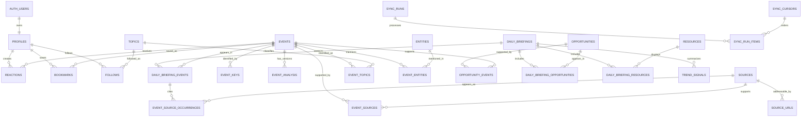

# AI Daily Intelligence Web V1 Database Schema

> 상태: 구현 전 최종 기술 검토 READY — 구현 지시 대기
> 작성일: 2026-08-07 (Asia/Seoul)
> 대상: Supabase PostgreSQL
> 원칙: Git 콘텐츠 정본을 Event 중심 서비스 조회 모델로 투영하고 사용자 데이터는 분리한다.

## 1. 데이터 소유권

| 데이터 | 정본 | Supabase 역할 |
|---|---|---|
| 일일 Intelligence 콘텐츠 | GitHub `main/data/daily/**` | 재구축 가능한 조회 projection |
| 날짜별 보고서 | GitHub `reports/**` | 링크 및 경로 참조 |
| 사용자 계정 | Supabase Auth | 인증 정본 |
| Profile, reaction, bookmark, follow | Supabase | 사용자 기능 정본 |
| Import 상태 | Supabase private operations schema | 동기화 운영 기록 |

콘텐츠 projection은 Git으로부터 재구축할 수 있어야 한다. 사용자 데이터는 Git backfill이나 콘텐츠 재동기화 과정에서 삭제하거나 덮어쓰면 안 된다.

## 2. ERD



## 3. Enum 설계

### 콘텐츠

```text
event_importance: S | A | B
publication_state: draft | published | archived | needs_review
briefing_status: complete | partial
analysis_language: ko | en
analysis_parse_status: parsed | partial | unparsed
opportunity_potential: Low | Medium | High | Very High
candidate_status: none | waiting_for_owner | approved_for_design | rejected
```

`approved_for_design`은 명시적인 사용자 승인 후 설계 상태만 나타내며 제품 구현 승인을 의미하지 않는다.

### Source

```text
source_type:
  official_blog | article | youtube | x | github |
  paper | documentation | reddit | hackernews | other

source_authority:
  official | primary | independent | analysis | community | unknown

verification_status:
  verified | corroborated | unverified | disputed

taxonomy_mapping_status:
  confirmed | rule_mapped | unknown | needs_review

source_url_kind:
  canonical | alternate | redirect | observed

event_key_status:
  canonical | alias | deprecated
```

`authority`는 Source 자체의 성격이고 `verification_status`는 특정 날짜의 Event 근거 상태이므로 각각 `sources`와 `event_source_occurrences`에 분리한다.

### 사용자와 운영

```text
reaction_sentiment: like | dislike
resource_type: tool | open_source | paper | youtube | blog | documentation | other
sync_status: running | succeeded | failed | skipped
```

## 4. 콘텐츠 테이블

### `daily_briefings`

날짜별 packet과 Today 구성을 나타낸다.

| Column | Type | Constraint/의미 |
|---|---|---|
| `id` | uuid | PK, generated |
| `date_kst` | date | UNIQUE, Git idempotency key |
| `generated_at` | timestamptz | required |
| `status` | briefing_status | required |
| `publication_state` | publication_state | required, default draft |
| `todays_insight` | text | required |
| `warnings` | jsonb | required, default `[]` |
| `schema_version` | text | required |
| `source_data_path` | text | required |
| `source_report_path` | text | nullable |
| `source_commit_sha` | text | required, import 대상 Git main snapshot |
| `source_revision` | bigint | nullable, 진단용 commit count이며 권위 순서 판정에는 사용하지 않음 |
| `source_checksum` | text | required |
| `identity_registry_checksum` | text | required |
| `projection_input_checksum` | text | required, packet + identity registry + mapper version |
| `imported_at` | timestamptz | required |
| `created_at` | timestamptz | required |
| `updated_at` | timestamptz | required |

제약:

- `date_kst` unique
- `source_checksum`은 SHA-256 형식 검사
- `warnings`는 JSON array 검사

### `events`

Event의 영구 UUID 정체성과 현재 표시 projection을 보유한다. Git `event_key`는 외부 입력 key이며 UUID 자체가 아니다.

| Column | Type | Constraint/의미 |
|---|---|---|
| `id` | uuid | PK |
| `canonical_event_key` | text | UNIQUE, 현재 대표 Git key; 변경 이력은 `event_keys`에 보존 |
| `slug` | text | UNIQUE, immutable public route key |
| `title_original` | text | required |
| `title_ko` | text | nullable |
| `one_line_summary_ko` | text | nullable |
| `importance` | event_importance | required |
| `hero_image_url` | text | nullable |
| `hero_image_source_id` | uuid | nullable FK → sources |
| `hero_image_attribution` | text | nullable, publisher/creator/source 표시 |
| `hero_image_alt_ko` | text | nullable |
| `publication_state` | publication_state | required |
| `first_seen_date` | date | required |
| `last_seen_date` | date | required |
| `current_source_commit_sha` | text | required |
| `current_source_revision` | bigint | nullable, diagnostics only |
| `source_schema_version` | text | required |
| `created_at` | timestamptz | required |
| `updated_at` | timestamptz | required |
| `merged_into_event_id` | uuid | nullable self FK, 검토된 merge의 redirect 대상 |

제약:

- `first_seen_date <= last_seen_date`
- `hero_image_url`이 있으면 `hero_image_source_id`와 `hero_image_attribution`이 모두 필요함
- importer는 연결 Source가 검증 가능한 원문 또는 공식 출처인지 확인하고 그렇지 않으면 image를 저장하지 않음
- AI 생성 이미지는 V1 Event hero image로 허용하지 않음
- Event hard delete 대신 `archived` 사용
- `id`는 최초 식별 시 결정한 canonical key의 고정 namespace UUID로 생성하고 이후 key 변경이나 merge로 바꾸지 않음
- `merged_into_event_id`가 있으면 자기 자신을 가리킬 수 없으며 공개 route는 대상 Event로 영구 redirect

### `event_keys`

Git 입력 key의 전체 이력을 Event UUID에 연결한다.

| Column | Type | Constraint/의미 |
|---|---|---|
| `event_key` | text | PK, Git 입력 원문 key |
| `event_id` | uuid | FK → events, required |
| `status` | event_key_status | required |
| `first_seen_date` | date | required |
| `last_seen_date` | date | required |
| `source_commit_sha` | text | required |
| `reason` | text | nullable, alias/폐기 사유 |

동일 key가 이미 다른 Event UUID에 연결되어 있으면 importer는 자동 merge하거나 덮어쓰지 않고 해당 packet을 `needs_review`로 격리한다. key 변경·분할·merge는 Git main의 versioned identity registry에 명시된 경우에만 적용한다. fuzzy title matching은 후보 탐지에만 사용할 수 있고 identity write 권한은 갖지 않는다.

### `event_analysis`

Event 분석을 버전과 언어별로 보존한다.

| Column | Type | Constraint/의미 |
|---|---|---|
| `id` | uuid | PK |
| `event_id` | uuid | FK → events, required |
| `version` | integer | positive |
| `language` | analysis_language | default ko |
| `briefing_id` | uuid | FK → daily_briefings, required |
| `analysis_date` | date | required, briefing date |
| `summary_raw` | text | required, Git `news[].summary` 원문 |
| `parse_status` | analysis_parse_status | required |
| `fact` | text | nullable for legacy mapping failure |
| `interpretation` | text | nullable |
| `signal` | text | nullable |
| `speculation` | text | nullable |
| `why_it_matters` | text | required |
| `outlook` | text | required |
| `business_opportunity` | text | nullable |
| `impact` | text | required |
| `industry_mood` | jsonb | required, default `{}` |
| `ai_score` | numeric(3,2) | nullable, 0~5 |
| `score_breakdown` | jsonb | nullable |
| `score_method_version` | text | nullable |
| `is_current` | boolean | required |
| `generated_at` | timestamptz | required |
| `source_commit_sha` | text | required |
| `source_revision` | bigint | nullable, diagnostics only |

제약:

- UNIQUE `(event_id, briefing_id, version, language)`
- UNIQUE `(id, event_id, briefing_id)` for composite membership FK
- partial UNIQUE `(event_id, language) WHERE is_current = true`
- `ai_score IS NULL OR ai_score BETWEEN 0 AND 5`
- score가 있으면 `score_method_version`도 있어야 함

`ai_score`와 breakdown은 향후 평가 체계를 보존할 수 있도록 DB에 유지하지만 V1 public UI와 public API response projection에는 포함하지 않는다. 공개 여부는 별도 결정 전까지 비활성이다.

현재 Git `summary`의 원문은 항상 `summary_raw`에 그대로 저장한다. importer는 네 label이 명확한 경우에만 구조 필드로 분리한다. 일부 label만 있으면 `partial`, label이 없으면 `unparsed`로 기록하고 알 수 없는 문장을 FACT로 승격하지 않는다. `unparsed`도 유효한 legacy packet으로 import할 수 있으며 UI는 구조 섹션 대신 `원문 분석`으로 `summary_raw`를 표시한다. 이 fallback은 데이터 손실이나 발행 중단 없이 기존 validator가 허용하는 자유 형식 summary를 보존한다.

### `sources`

| Column | Type | Constraint/의미 |
|---|---|---|
| `id` | uuid | PK |
| `source_type` | source_type | required |
| `authority` | source_authority | required |
| `taxonomy_mapping_status` | taxonomy_mapping_status | required |
| `taxonomy_rule_version` | text | nullable |
| `title` | text | required |
| `publisher` | text | required |
| `author` | text | nullable |
| `published_at` | timestamptz | nullable |
| `published_date_text` | text | nullable legacy 원문 |
| `external_id` | text | nullable, YouTube/GitHub 등 |
| `provider` | text | nullable, external ID namespace |
| `thumbnail_url` | text | nullable |
| `metadata` | jsonb | required, default `{}` |
| `created_at` | timestamptz | required |
| `updated_at` | timestamptz | required |

`sources.id`가 Source identity다. URL 하나를 곧바로 Source identity로 간주하지 않는다. `source_type`을 확정할 수 없으면 `other`, `authority`를 확정할 수 없으면 `unknown`, 관계 검증은 `unverified`로 보존한다. 공식 도메인 registry나 명시적 검토 없이 `official` 또는 `verified`로 승격하지 않는다.

### `source_urls`

하나의 Source에 canonical, alternate, redirect, observed URL을 여러 개 연결한다.

| Column | Type | Constraint/의미 |
|---|---|---|
| `id` | uuid | PK |
| `source_id` | uuid | FK → sources, required |
| `raw_url` | text | required, 최초 관측 문자열 |
| `normalized_url` | text | UNIQUE, deterministic normalization 결과 |
| `url_kind` | source_url_kind | required |
| `is_current_canonical` | boolean | required, default false |
| `first_seen_at` | timestamptz | required |
| `last_seen_at` | timestamptz | required |
| `source_commit_sha` | text | required |
| `redirect_chain` | jsonb | nullable, 검증한 경우에만 저장 |

Source마다 current canonical URL은 최대 하나다. canonical URL 변경 시 이전 URL을 삭제하지 않고 `alternate`로 남긴다. 서로 다른 normalized URL은 provider ID, 검증된 HTML canonical, 명시적 redirect 관계 또는 Git identity registry가 일치를 증명할 때만 같은 Source로 합친다.

`provider`와 `external_id`가 모두 존재하면 `(provider, external_id)` unique를 적용한다. provider namespace가 없는 ID끼리는 같은 콘텐츠로 간주하지 않는다.

정규화 규칙은 versioned pure function으로 관리한다.

- 공통: HTTP(S)만 허용하고 scheme/host 소문자화, default port·fragment 제거, percent encoding 정규화, 명시적 tracking denylist만 제거한다. 의미를 모르는 query parameter는 보존한다.
- Redirect: importer는 임의 URL을 무제한 추적하지 않는다. redirect 검증이 필요하면 public HTTP(S) 주소만, DNS/IP 재검증, private/link-local 차단, 제한된 hop/timeout으로 수행하고 chain을 보존한다. 검증 실패 시 observed URL을 그대로 사용한다.
- YouTube: `youtu.be`, `watch?v=`, `shorts`, `embed`는 검증된 video ID 기준 canonical watch URL로 통합한다. playlist·timestamp 등 의미 있는 값은 별도 metadata로 보존한다.
- X: `twitter.com`/`x.com`의 status URL은 status ID 기준으로 통합하고 공유 tracking parameter만 제거한다. profile/search URL과 status URL을 합치지 않는다.
- GitHub: repository, release, issue, pull request, commit, blob/raw URL을 서로 다른 resource로 유지한다. repository root에서만 `.git` suffix 등의 안전한 규칙을 적용한다.
- 동일 콘텐츠의 다른 URL: title 유사도나 content hash만으로 자동 병합하지 않는다. canonical evidence가 불충분하면 별도 Source로 두고 `needs_review`를 기록한다.

### `event_sources`

| Column | Type | Constraint/의미 |
|---|---|---|
| `event_id` | uuid | FK → events |
| `source_id` | uuid | FK → sources |
| `first_seen_date` | date | required |
| `last_seen_date` | date | required |
| `source_commit_sha` | text | required |

PK: `(event_id, source_id)`

`event_sources`는 Event와 Source의 장기 연결 및 first/last seen만 보존한다. 날짜별 검증 상태, 대표 여부, 순서와 인용문은 아래 occurrence table에 저장하며 전역 row를 최신 값으로 덮어쓰지 않는다.

### `event_source_occurrences`

- `briefing_id uuid FK`
- `event_id uuid FK`
- `source_id uuid FK`
- `verification_status verification_status required`
- `is_primary boolean default false`
- `display_order integer non-negative`
- `key_quote text nullable`
- `quote_translation text nullable`
- `source_commit_sha text required`
- `source_revision bigint nullable, diagnostics only`
- PK `(briefing_id, event_id, source_id)`
- composite FK `(briefing_id, event_id) → daily_briefing_events(briefing_id, event_id)`
- FK `(event_id, source_id) → event_sources(event_id, source_id)`

이 table로 같은 Source의 verification이 날짜별로 달라지거나 correction되는 경우에도 이전 Briefing의 근거 상태를 보존한다.

### `topics`와 `event_topics`

`topics`:

- `id uuid PK`
- `slug text UNIQUE`
- `name_ko text required`
- `description text nullable`
- `publication_state`
- timestamps

`event_topics`:

- `event_id uuid FK`
- `topic_id uuid FK`
- `relevance_score numeric nullable 0~1`
- `is_primary boolean`
- PK `(event_id, topic_id)`

현재 Git `tags[]`를 정규화된 Topic으로 import한다. 동의어 병합은 V1 자동 sync에서 추측하지 않고 명시적 alias 규칙이 있을 때만 수행한다.

### `entities`와 `event_entities`

`entities`:

- `id uuid PK`
- `entity_type text`
- `canonical_name text`
- `display_name_ko text nullable`
- `aliases jsonb default []`
- `publication_state publication_state`
- UNIQUE `(entity_type, canonical_name)`

`event_entities`:

- `event_id uuid FK`
- `entity_id uuid FK`
- `role text nullable`
- PK `(event_id, entity_id)`

현재 Git packet에는 명시적 Entity 배열이 없으므로 V1 importer는 확실한 명시 데이터가 없는 경우 Entity 관계를 만들지 않는다.

## 5. Briefing 관계 테이블

### `daily_briefing_events`

- `briefing_id uuid FK`
- `event_id uuid FK`
- `display_order integer`
- `analysis_id uuid required`
- `section text default 'top_news'`
- `title_original text required`
- `title_ko text nullable`
- `one_line_summary_ko text nullable`
- `importance event_importance required`
- `hero_image_source_id uuid nullable`
- `hero_image_url text nullable`
- `hero_image_attribution text nullable`
- `source_commit_sha text required`
- `source_revision bigint nullable, diagnostics only`
- PK `(briefing_id, event_id)`
- UNIQUE `(briefing_id, display_order)`
- composite FK `(analysis_id, event_id, briefing_id) → event_analysis(id, event_id, briefing_id)`

복합 FK는 Briefing–Event membership이 다른 Briefing 또는 다른 Event의 analysis를 참조하는 것을 DB 수준에서 차단한다.

이 관계가 날짜별 Event occurrence이자 표시 snapshot이다. 과거 Briefing은 `events`의 최신 제목·중요도·이미지를 역참조하지 않고 이 snapshot과 해당 `event_analysis` version을 사용한다. 따라서 같은 Event가 여러 날짜에 재등장하거나 과거 packet이 correction되어도 다른 날짜의 표시 정보가 덮어써지지 않는다.

### `opportunities`

- `id uuid PK`
- `stable_key text UNIQUE`
- `name text`
- `customer text`
- `problem text`
- `competitors jsonb default []`
- `differentiation text`
- `mvp_2_weeks text`
- `difficulty text`
- `monetization text`
- `falsification text`
- `score numeric(3,2) 0~5`
- `stars smallint 1~5`
- `potential opportunity_potential`
- `first_seen_date date`
- `last_seen_date date`
- `publication_state publication_state`
- timestamps

Opportunity 본체에는 build-candidate 상태를 저장하지 않는다. 후보 여부는 특정 날짜 packet의 판단이므로 `daily_briefing_opportunities`의 occurrence 필드로 관리한다.

### `daily_briefing_opportunities`

- `briefing_id uuid FK`
- `opportunity_id uuid FK`
- `display_order integer`
- `candidate_status candidate_status default none`
- `owner_action_required boolean default false`
- `candidate_score numeric(3,2) nullable`
- `name text required`
- `customer text required`
- `problem text required`
- `differentiation text required`
- `mvp_2_weeks text required`
- `difficulty text required`
- `monetization text required`
- `falsification text required`
- `score numeric(3,2) required`
- `stars smallint required`
- `potential opportunity_potential required`
- `source_commit_sha text required`
- PK `(briefing_id, opportunity_id)`

제약:

- `candidate_status = waiting_for_owner`이면 `owner_action_required = true`
- 후보가 아닌 occurrence는 `candidate_status = none`, `owner_action_required = false`
- 같은 Opportunity가 다른 날짜에 재등장해도 각 Briefing의 후보 판단은 독립적임
- 목록과 과거 Briefing은 occurrence snapshot을 읽어 전역 `opportunities` 최신 필드 변경으로 과거 평가가 덮어써지지 않음
- 후보 표시가 제품 구현 권한을 부여하지 않음

### `opportunity_events`

- `opportunity_id uuid FK`
- `event_id uuid FK`
- `evidence_role text nullable`
- PK `(opportunity_id, event_id)`

명시적인 supporting Event key가 있을 때만 생성한다.

### `resources`

- `id uuid PK`
- `normalized_url text UNIQUE`
- `resource_type resource_type`
- `title text`
- `url text`
- `stars smallint nullable 1~5`
- `summary text nullable`
- `why_relevant text`
- `metadata jsonb default {}`
- `publication_state publication_state`
- timestamps

### `daily_briefing_resources`

- `briefing_id uuid FK`
- `resource_id uuid FK`
- `section text`
- `display_order integer`
- PK `(briefing_id, resource_id, section)`

### `trend_signals`

- `id uuid PK`
- `briefing_id uuid FK`
- `signal_type text`
- `label text`
- `summary text`
- `mood text nullable`
- `strength numeric nullable 0~1`
- `source_url text nullable`
- `display_order integer`
- `metadata jsonb default {}`

현재 Git `community[]`는 daily trend signal로 import한다. 장기 Topic 추세 계산 결과와 editorial community signal은 `signal_type`으로 구분한다.

## 6. 사용자 테이블

### `profiles`

- `id uuid PK FK → auth.users(id) ON DELETE CASCADE`
- `display_name text nullable`
- `avatar_url text nullable`
- `locale text default 'ko-KR'`
- timestamps

V1에서 profile은 다른 사용자에게 공개하지 않는다.

### `reactions`

- `user_id uuid FK → profiles ON DELETE CASCADE`
- `event_id uuid FK → events ON DELETE RESTRICT`
- `sentiment reaction_sentiment nullable`
- `interested boolean default false`
- timestamps
- PK `(user_id, event_id)`
- CHECK `sentiment IS NOT NULL OR interested = true`

좋아요와 싫어요를 단일 nullable sentiment로 저장하여 동시에 선택할 수 없게 한다. 두 값 모두 해제되면 row를 삭제한다.

### `bookmarks`

- `user_id uuid FK → profiles ON DELETE CASCADE`
- `event_id uuid FK → events ON DELETE RESTRICT`
- `created_at timestamptz`
- PK `(user_id, event_id)`

### `follows`

- `user_id uuid FK → profiles ON DELETE CASCADE`
- `topic_id uuid FK → topics ON DELETE RESTRICT`
- `created_at timestamptz`
- PK `(user_id, topic_id)`

## 7. 운영 테이블

운영 테이블은 API에 노출하지 않는 `private` schema를 사용한다.

### `private.sync_runs`

- `id uuid PK`
- `source_commit_sha text`
- `source_revision bigint`
- `trigger_type text`
- `started_at`, `finished_at`
- `status sync_status`
- `input_packet_count integer`
- `output_counts jsonb`
- `warning_count integer`
- `error_code text nullable`
- `error_summary text nullable`

### `private.sync_run_items`

- `id uuid PK`
- `sync_run_id uuid FK`
- `packet_path text`
- `date_kst date nullable`
- `checksum text`
- `identity_registry_checksum text`
- `projection_input_checksum text`
- `status sync_status`
- `input_counts jsonb`
- `output_counts jsonb`
- `error_summary text nullable`
- partial UNIQUE INDEX `(packet_path, projection_input_checksum) WHERE status = 'succeeded'`

실패한 같은 입력은 여러 run에서 재시도할 수 있어야 하므로 성공 row에만 부분 unique index를 적용한다. 오류 요약에는 secret, access token, 사용자 개인정보 또는 전체 원본 payload를 기록하지 않는다.

같은 projection 입력이 다른 commit에서 다시 전달되어도 `(packet_path, projection_input_checksum)`이 같으면 이미 처리된 입력으로 본다. Raw packet이 같아도 identity registry 또는 mapper version이 다르면 별도 입력이다. Commit SHA는 감사와 순서 정보이며 멱등 키 자체는 아니다.

### `private.sync_cursors`

- `packet_path text PK`
- `authoritative_commit_sha text`
- `authoritative_revision bigint nullable, diagnostics only`
- `authoritative_checksum text`
- `authoritative_projection_checksum text`
- `updated_at timestamptz`

이 table은 raw packet checksum 및 projection input checksum과 별도로 각 packet path에서 마지막으로 수락한 Git main commit을 보존한다. 순서의 권위는 commit count가 아니라 commit ancestry다. 같은 내용으로 되돌아오는 descendant commit도 SHA watermark를 전진시켜 지연된 중간 commit이 나중에 정본을 덮어쓰지 못하게 한다. Projection input checksum은 packet bytes, identity registry checksum과 importer mapping version을 포함하므로 registry 또는 mapper가 바뀌면 raw JSON이 같아도 재투영한다.

## 8. RLS 정책

모든 `public` schema table에 RLS를 활성화한다.

### 콘텐츠 projection

일반 사용자의 콘텐츠 INSERT/UPDATE/DELETE는 모두 금지하고 service-role sync job만 write한다. SELECT policy는 table별로 다음 조건을 사용한다.

| Table | `anon`, `authenticated` SELECT predicate |
|---|---|
| `daily_briefings` | `publication_state = 'published'` |
| `events` | `publication_state = 'published'` |
| `event_analysis` | `EXISTS (published daily_briefing_events where analysis_id = id)`; 선택되지 않은 superseded version은 공개하지 않음 |
| `daily_briefing_events` | `EXISTS (published briefing) AND EXISTS (published event)` |
| `event_keys` | 직접 공개 금지; server-side resolution만 허용 |
| `sources` | `EXISTS (event_source_occurrences → published briefing/event)` |
| `source_urls` | `is_current_canonical = true AND EXISTS (source → published occurrence)`; raw alias/redirect 이력은 직접 공개하지 않음 |
| `event_sources` | `EXISTS (published event_source_occurrences for same event/source)` |
| `event_source_occurrences` | `EXISTS (published briefing) AND EXISTS (published event)` |
| `topics` | `publication_state = 'published'` |
| `event_topics` | `EXISTS (published event) AND EXISTS (published topic)` |
| `entities` | `publication_state = 'published' AND EXISTS (event_entities → published event)` |
| `event_entities` | `EXISTS (published event) AND EXISTS (published entity)` |
| `opportunities` | `publication_state = 'published'` |
| `daily_briefing_opportunities` | `EXISTS (published briefing) AND EXISTS (published opportunity)` |
| `opportunity_events` | `EXISTS (published opportunity) AND EXISTS (published event)` |
| `resources` | `publication_state = 'published'` |
| `daily_briefing_resources` | `EXISTS (published briefing) AND EXISTS (published resource)` |
| `trend_signals` | `EXISTS (published briefing)` |

`EXISTS` 조건은 FK join과 `publication_state`를 함께 확인한다. 직접 table select와 join 경로 모두에 대해 `anon`, `authenticated`, `service_role` 역할별 DB policy test를 작성한다. Draft Event에만 연결된 Source, URL alias, unreviewed relation이 공개 query로 누출되지 않는 test case를 포함한다. 공개 view는 PostgreSQL 15+의 `security_invoker = true`로 만들거나 노출 schema 밖에 두며, materialized view와 함수도 별도로 GRANT/RLS 누출 검사를 한다.

Briefing이 public select 대상이 되려면 `publication_state = published`여야 한다. `status = complete`와 `status = partial` 모두 published가 될 수 있다. Partial Briefing은 `warnings`와 상태를 함께 제공하며 Web UI가 비차단 안내를 표시한다.

### 사용자 데이터

| Table | SELECT | INSERT | UPDATE | DELETE |
|---|---|---|---|---|
| profiles | 본인 | 본인/가입 trigger | 본인 | 직접 DELETE 금지; server-side account deletion cascade만 허용 |
| reactions | 본인 | 본인 | 본인 | 본인 |
| bookmarks | 본인 | 본인 | 해당 없음 | 본인 |
| follows | 본인 | 본인 | 해당 없음 | 본인 |

모든 policy는 `(select auth.uid()) = user_id` 또는 profile PK와 같은 식으로 소유권을 확인한다. mutation에는 `WITH CHECK`를 별도로 명시한다.

`profiles.id`는 `auth.users.id ON DELETE CASCADE`를 참조하고, `reactions`, `bookmarks`, `follows`의 `user_id`는 `profiles.id ON DELETE CASCADE`를 참조한다. 계정 삭제는 재인증된 server-side account-deletion flow가 Admin API로 `auth.users`를 삭제하는 것으로 시작하며, DB cascade가 개인 데이터를 제거한다. authenticated 사용자의 profile 직접 DELETE policy는 만들지 않는다. 콘텐츠 FK에는 user row 방향 cascade를 설정하지 않는다.

V1 Supabase Auth provider는 Google OAuth 하나만 활성화한다. Provider token은 `auth.users` 또는 Supabase session에서 관리하고 application table에 복제하지 않는다. 향후 provider 추가를 위해 `profiles`는 Google 고유 ID에 종속시키지 않고 `auth.users.id`만 참조한다.

service-role importer는 사용자 cookie를 읽는 SSR client와 코드·인스턴스를 공유하지 않는 전용 server-only client를 사용한다. service key가 들어간 client의 Authorization header를 사용자 session token으로 교체할 수 없게 하고, secret은 GitHub Actions 환경에만 주입하며 URL, payload, error log에 포함하지 않는다.

OAuth callback은 Supabase PKCE code exchange 후에만 session을 설정한다. production callback URL은 exact allowlist로 등록하고 wildcard는 preview 환경에 한정한다. return path는 단일 `/`로 시작하는 허용 route만 인정하며 `//`, `\\`, scheme/host, 제어문자, 중복·다중 percent encoding을 거부한다. 검증 실패 시 `/`로 복귀한다. middleware는 session refresh만 수행하고 공개 route의 비로그인 사용자를 `/login`으로 보내지 않는다.

### Import RPC

- content 함수: `public.import_daily_packet(packet_path text, payload jsonb, source_commit_sha text, expected_cursor_sha text, source_revision bigint, raw_checksum text, identity_registry_checksum text, projection_input_checksum text)`
- identity 함수: `public.apply_identity_registry(event_registry jsonb, source_registry jsonb, source_commit_sha text, registry_checksum text, expected_registry_commit_sha text, expected_registry_checksum text)`
- watermark read 함수: `public.get_sync_cursor(packet_path text)`, `public.get_identity_registry_state()`
- transaction 단위로 실행
- `SECURITY DEFINER` 사용 시 고정 `search_path` 설정
- Data API에서 호출 가능한 좁은 `public` RPC façade만 두고 object owner를 migration 전용 role로 고정한다. 운영 table은 계속 API 비노출 `private` schema에 둔다.
- `anon`, `authenticated`, `PUBLIC`의 execute 권한 revoke
- `service_role`에만 execute grant
- 함수 내부 object는 schema-qualified name만 사용하고 dynamic SQL을 금지
- 입력 packet을 다시 검증하고 예상하지 않은 schema version 거부
- RPC 진입 즉시 고정 advisory transaction lock을 획득해 content import를 직렬화
- workflow가 전달한 `expected_cursor_sha`와 lock 안의 실제 cursor SHA가 다르면 write 없이 `retry_cursor_changed`
- identity registry도 commit SHA와 checksum을 함께 CAS하고 값이 다르면 registry row를 변경하지 않은 채 `retry_registry_changed`
- packet import는 lock 안에서 live identity registry checksum을 다시 확인해 registry apply와 packet import 사이의 경쟁을 거부
- workflow는 Git에서 cursor SHA와 incoming SHA의 ancestry를 검증하고 그 결과에 따라 호출 여부를 결정한다. RPC는 Git을 판정하지 않고 trusted service importer가 전달한 incoming SHA와 `expected_cursor_sha`의 CAS만 강제한다.
- same SHA는 duplicate로 호출하지 않고, cursor가 incoming의 ancestor이면 descendant correction으로 호출하며, incoming이 cursor의 ancestor이거나 두 SHA가 diverged/불명확하면 workflow가 각각 superseded 또는 reconcile failure로 종료한다.
- 수락한 descendant는 같은 checksum이어도 commit SHA cursor를 먼저 전진
- watermark 전진 후 projection input checksum이 현재 projection과 같으면 content write 없이 `skipped: content_unchanged_revision_advanced`로 commit
- raw packet이 같아도 identity registry 또는 mapper version이 달라 projection input checksum이 바뀌면 content projection을 reconcile upsert
- `daily_briefings.projection_input_checksum`과 sync item uniqueness를 같은 멱등 정의로 유지
- Workflow는 full history checkout에서 `git merge-base --is-ancestor`로 stored cursor, incoming commit, 현재 remote main snapshot의 관계를 확인한다. `git rev-list --count` 값은 로그용일 뿐 권위 비교에 사용하지 않는다.
- Briefing correction은 incoming commit이 stored cursor의 descendant일 때만 적용한다.
- Event의 현재 표시 필드와 `is_current` analysis는 날짜가 더 최신이거나, 같은 날짜에서 accepted descendant correction일 때만 전진한다.
- 과거 날짜 correction은 해당 Briefing occurrence와 analysis version을 갱신하지만 더 최신 Event current state를 덮어쓰지 않음

V1은 단일 global advisory lock으로 모든 registry/content import를 직렬화한다. GitHub Actions concurrency와 advisory lock은 도착 순서를 보장하지 않으므로 workflow의 commit ancestry 검증, registry 2-field CAS와 RPC의 per-path cursor CAS를 함께 사용한다. Checksum no-op보다 SHA watermark 갱신을 먼저 수행한다. Main write workflow는 매번 하나의 고정된 main HEAD snapshot에서 identity registry를 먼저 적용하고 전체 archive를 날짜 오름차순으로 reconcile하며, 각 packet cursor에는 그 snapshot SHA를 기록한다. 따라서 GitHub가 이전 pending run을 대체해도 최신 snapshot이 중간 변경을 흡수한다. Force-push, diverged history, shallow history 또는 cursor 불일치는 자동 순서를 추측하지 않고 reconcile/retry로 중단한다.

## 9. Index와 조회 경로

필수 index:

- `daily_briefings(date_kst desc)` unique
- `events(canonical_event_key)` unique
- `events(slug)` unique
- `events(publication_state, last_seen_date desc)`
- `event_keys(event_key)` PK, `event_keys(event_id, status)`
- `event_analysis(event_id, language, is_current)`
- `source_urls(normalized_url)` unique
- partial UNIQUE `source_urls(source_id) WHERE is_current_canonical = true`
- partial UNIQUE `sources(provider, external_id) WHERE provider IS NOT NULL AND external_id IS NOT NULL`
- `sources(source_type, authority)`
- 모든 join table의 역방향 FK index
- `opportunities(publication_state, last_seen_date desc)`
- `trend_signals(briefing_id, display_order)`
- `reactions(user_id, updated_at desc)`
- `bookmarks(user_id, created_at desc)`
- `follows(user_id, created_at desc)`

V1에 검색 화면 요구가 없으므로 full-text search index는 미리 추가하지 않는다. 검색이 승인되면 한국어 형태소 처리 요구를 먼저 검토한다.

## 10. Git field mapping

| Git JSON | Supabase |
|---|---|
| `date_kst` | `daily_briefings.date_kst` |
| `generated_at` | `daily_briefings.generated_at` |
| `status` | `daily_briefings.status` |
| `warnings` | `daily_briefings.warnings` |
| `todays_insight` | `daily_briefings.todays_insight` |
| `news[].event_key` | `event_keys.event_key`로 resolve → `events.id`; 현재 대표 key는 `events.canonical_event_key` |
| `news[].title` | `events.title_original`; Korean이면 `title_ko` 후보 |
| `news[].one_line_summary` | `events.one_line_summary_ko` if Korean |
| `news[].importance` | `events.importance` |
| `news[].summary` | `event_analysis.summary_raw`; 명확한 label만 구조 필드로 추가 파싱 |
| `news[].impact` | `event_analysis.impact` |
| `news[].why_it_matters` | `event_analysis.why_it_matters` |
| `news[].outlook` | `event_analysis.outlook` |
| `news[].business_opportunity` | `event_analysis.business_opportunity` |
| `news[].industry_mood` | `event_analysis.industry_mood` |
| `news[].sources[]` | `sources`, `source_urls`, `event_sources`, `event_source_occurrences` |
| `news[].tags[]` | `topics`, `event_topics` |
| `business_ideas[]` | `opportunities`, `daily_briefing_opportunities`; legacy fallback key는 `date_kst + normalized name` |
| `build_candidate` | 해당 `daily_briefing_opportunities` occurrence candidate fields |
| `tools[]` | `resources(type=tool)` |
| `worth_reading[]` | `resources` |
| `community[]` | `trend_signals` |

## 11. 삭제, 정정, 복구

### 정정

- 같은 날짜 packet의 checksum이 바뀌면 해당 Briefing membership과 표시 순서를 transaction 안에서 교체한다.
- Event와 Source의 stable ID는 유지한다.
- 현재 analysis는 해당 Briefing occurrence에 새 version을 만들고 이전 version을 보존한다.
- 입력 날짜가 Event의 `last_seen_date`보다 과거면 전역 current Event 표시와 `is_current` analysis를 뒤로 되돌리지 않는다.
- correction으로 기존 occurrence를 제거할 때 affected Event와 Opportunity의 first/last seen, current 표시, `is_current` analysis를 남은 occurrence에서 같은 transaction으로 재계산한다.
- 제거된 occurrence가 current였으면 가장 최신의 남은 occurrence를 current로 승격하고, 남은 published occurrence가 없으면 본체를 `archived`로 전환한다. bookmark/reaction 때문에 Event를 hard delete하지 않는다.

### 삭제

- Git packet에서 사라졌다는 이유만으로 공유 Event/Source를 즉시 hard delete하지 않는다.
- Briefing 관계를 제거하고 참조가 없는 콘텐츠를 reconcile 대상 또는 archived 상태로 표시한다.
- 사용자 reaction/bookmark가 연결된 Event는 content archive 상태에서도 referential integrity를 유지한다.

### 복구

1. Git main의 한 immutable snapshot SHA를 고정하고 migrations, `data/daily/**`, versioned identity registry를 검증한다.
2. 신규 DB이면 migration 후 콘텐츠를 빈 projection에 backfill한다. 이 경우 Git으로 복구되는 범위는 콘텐츠이며 Auth/사용자 데이터는 포함하지 않는다.
3. 사용자 데이터가 있는 운영 DB이면 content table을 truncate하지 않는다. 별도 staging projection에 날짜순으로 backfill하고 count, checksum, identity collision과 관계 무결성을 검증한다.
4. 검증된 staging 결과를 stable Event UUID 기준으로 운영 content에 transaction/reconcile upsert하고, snapshot에서 사라진 content는 hard delete 대신 archived 처리한다.
5. `profiles`, `reactions`, `bookmarks`, `follows`, `auth.users`는 rebuild 대상/삭제 권한에서 제외하며 전후 row count와 FK를 검증한다.
6. latest date, occurrence별 checksum, 모든 alias resolve, current projection을 검증한 뒤 cache를 재검증한다.

Event key alias/merge와 Source URL alias/canonical override는 Supabase에서만 편집하지 않는다. Git main의 schema-validated `data/identity/event-aliases.json`과 `data/identity/source-aliases.json`은 reviewed override이고, importer는 고정된 snapshot의 전체 daily archive에서 아직 없는 Event key와 normalized Source URL을 deterministic UUIDv5로 발견해 complete effective registry를 만든다. Event registry entry는 immutable `event_uid`와 `identity_seed`, canonical key, aliases, merge target과 사유를 포함하고 Source registry entry는 immutable `source_uid`와 `identity_seed`, provider/external ID, canonical URL, aliases와 merge 사유를 포함한다. 기존 `schema/daily.schema.json`과 AI Researcher 출력은 변경하지 않으며, key rename·alias·merge는 별도 review와 correction commit으로 관리한다. 따라서 새 daily identity는 자동 수용되지만 서로 다른 key를 같은 Event로 추측하지 않는다.

### 필수 sync test matrix

- 같은 `(packet_path, projection_input_checksum)`의 순차 중복 실행
- 같은 입력의 동시 두 실행
- 같은 날짜의 새 checksum correction
- 같은 날짜에서 newer revision이 먼저 성공한 뒤 older different-checksum run이 도착하는 역순 실행
- revision 10 checksum A → revision 15 checksum B → revision 20 checksum A reversion 후 지연된 revision 15/B 도착
- same SHA duplicate, ancestor 지연 실행, descendant correction, diverged/force-push, cursor CAS race
- identity-only correction과 mapper version 변경이 raw packet no-op으로 잘못 skip되지 않음
- 최신 Event가 존재할 때 과거 날짜 correction
- 최신 occurrence 제거 후 남은 날짜로 current/first/last 재계산, 남은 published occurrence가 없을 때 archive
- RPC 중간 constraint failure와 전체 rollback
- 전체 backfill 후 incremental sync
- candidate → non-candidate 및 non-candidate → candidate occurrence 전환
- label 없는 유효 `summary`의 비손실 import
- 모든 사용자 데이터가 존재하는 계정 삭제 cascade
- `(briefing_id, event_id)`와 불일치하는 `analysis_id` composite FK 거부
- 동일 Event가 여러 날짜에 등장할 때 occurrence title/importance/analysis/source verification/primary/order가 서로 독립적으로 보존됨
- event key alias 변경, key collision quarantine, reviewed merge redirect와 Git registry 기반 재구축
- tracking parameter, redirect, YouTube, X, GitHub, canonical URL normalization fixture
- anon/authenticated의 private table·definer function·view 우회 거부와 service credential client bundle 부재

## 12. 미결정 사항

1. Supabase project region과 backup/PITR 수준
2. Source taxonomy rule registry의 최초 confirmed 항목
3. Event analysis version 생성 조건
4. Opportunity stable key와 supporting event key를 Git contract에 추가할지

## 13. Phase A 구현 매핑

- `supabase/migrations/20260808000100_initial_v1_schema.sql`: enum, public content/user table, private identity/sync table, index, trigger, GRANT와 RLS 정책
- `supabase/migrations/20260808000200_identity_and_import_rpc.sql`: identity registry 적용과 daily packet 원자적 import RPC
- `data/identity/event-aliases.json`, `data/identity/source-aliases.json`: Git main이 추적하는 stable identity bootstrap registry
- `schema/event-aliases.schema.json`, `schema/source-aliases.schema.json`: registry 형식 계약
- `supabase/tests/verify-foundation.mjs`: DB runtime 없이 수행하는 구조·권한·fixture 정적 계약 테스트
- `supabase/tests/schema_contract.sql`: migration 적용 후 수행하는 RLS/권한 검증문

Phase A migration은 기존 daily schema를 변경하지 않는다. service-role guard는 PostgREST `request.jwt.claims`와 직접 DB 세션의 `session_user`를 구분해 처리하되 anon/authenticated/PUBLIC의 RPC 실행 권한과 service-role의 public table 직접 write를 허용하지 않는다. identity registry는 이전 identity를 생략할 수 없는 complete append-preserving snapshot이며, `private.identity_registry_state` checksum을 import transaction 안에서 확인해 registry 적용과 packet import 사이의 경쟁을 fail-closed로 처리한다. merge target은 registry 내부에 존재하는 단일 단계 target만 허용하고, target Event가 projection에 존재하면 기존 Event를 archived redirect row로 갱신한다. 실제 PostgreSQL 실행 및 역할별 RLS 검증은 로컬 또는 preview Supabase runtime을 준비한 뒤 필수 gate로 수행한다.
